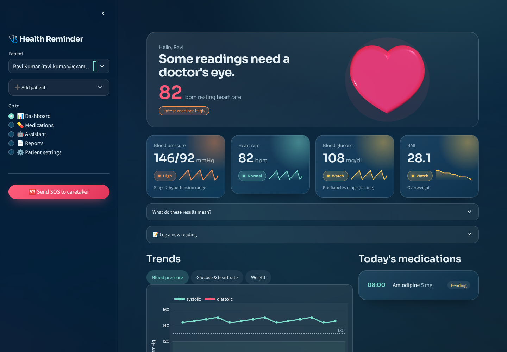
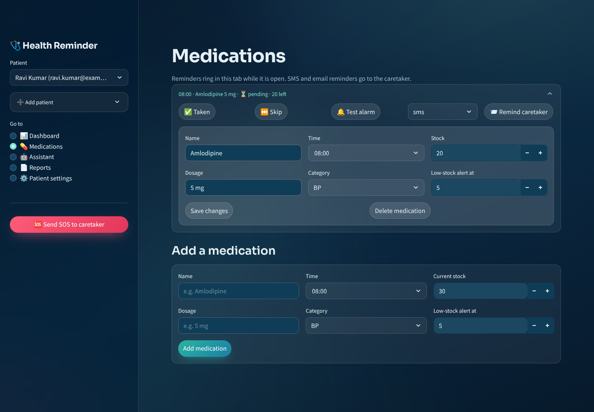
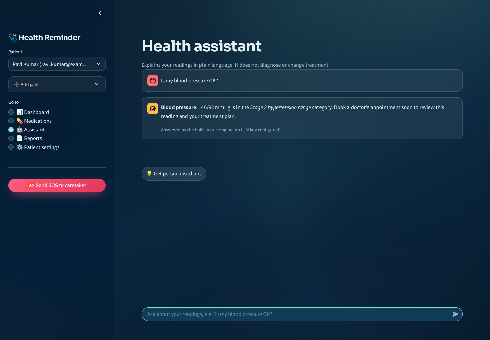
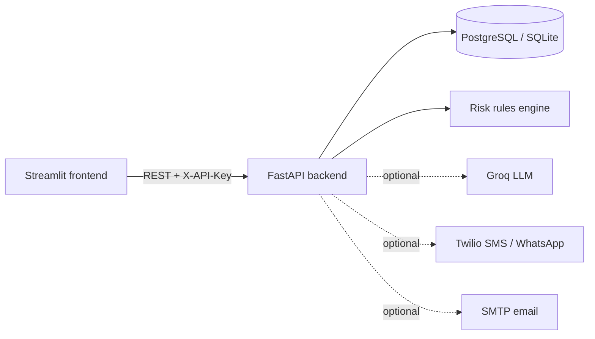

# Health Reminder Tracker

[](https://github.com/Sandeepsrinivasan-14/Health-Reminder-Tracker/actions/workflows/ci.yml)


[](LICENSE)

A patient-facing app for people managing hypertension, diabetes or similar chronic conditions. Patients log
their vitals and medications; the app flags readings against clinical reference ranges, rings an alarm when a
dose is due, tracks stock, and lets the patient alert a caretaker by SMS, WhatsApp or email with one tap.

[](https://render.com/deploy?repo=https://github.com/Sandeepsrinivasan-14/Health-Reminder-Tracker)

| Dashboard | Medications | Assistant |
|---|---|---|
|  |  |  |

## Design

The interface uses a "night lagoon" palette: deep-ocean background with slow aurora light, frosted-glass
cards, mint for healthy readings and coral for the heart. The dashboard opens with a **3D glass heart
(three.js) that beats at the patient's latest logged heart rate**, followed by one card per vital with a
severity pill and a 14-reading sparkline. Fonts (Sora, Figtree; SIL OFL) are self-hosted so no third party
sees patient visits, and the animation stops when the OS asks for reduced motion.

## Features

- **Vitals tracking**: blood pressure, resting heart rate, blood glucose (fasting / random / post-meal) and weight, with validation that rejects physiologically impossible values.
- **Threshold-based risk flags**: every reading is classified with published adult reference ranges (ACC/AHA 2017 blood-pressure categories, ADA glucose cut-offs, WHO BMI bands). The rules are deterministic and unit-tested, so the same reading always gets the same result.
- **Medication reminders**: schedules, a per-day taken/skipped log, automatic stock counting, low-stock warnings and an in-browser alarm (sound, speech and a modal) when a dose is due.
- **Caretaker alerts**: one-tap SOS and per-medication reminders over SMS or WhatsApp (Twilio) and email (SMTP). Every alert attempt is logged with its delivery status.
- **Health assistant**: explains the patient's own readings in plain language. It uses an LLM (Groq, Llama 3.3) when a key is configured, grounded in the rule-based assessment, and falls back to the rule engine otherwise. It is instructed never to diagnose or change medication.
- **Reports**: PDF summary for a doctor's visit and CSV export of all readings.

## Architecture



```text
backend/
  app/
    main.py            FastAPI app factory, CORS, /health
    config.py          settings from environment variables
    models.py          SQLAlchemy models (patients, vitals, medications, doses, alerts)
    schemas.py         Pydantic validation
    risk.py            clinical threshold rules
    routers/           users, vitals, medications, alerts, assistant, reports
    services/          LLM assistant, Twilio/SMTP notifier, PDF/CSV reports
    seed.py            demo data
  tests/               41 unit and API tests
frontend/
  streamlit_app.py     UI
  theme.py             glass theme, 3D heart hero, vital cards, chart styling
  static/fonts/        self-hosted Sora and Figtree
  api_client.py        typed API client
  tests/               end-to-end tests (real UI against a real API server)
docker-compose.yml     PostgreSQL + API + frontend
render.yaml            one-click Render deployment
```

## Quick start

### Option 1: local Python (SQLite, no external services)

```bash
git clone https://github.com/Sandeepsrinivasan-14/Health-Reminder-Tracker.git
cd Health-Reminder-Tracker
python -m venv .venv && source .venv/bin/activate      # Windows: .venv\Scripts\activate
pip install -r backend/requirements-dev.txt -r frontend/requirements.txt

cd backend
python -m app.seed                                     # optional demo patients
uvicorn app.main:app --reload                          # API on http://localhost:8000/docs
```

In a second terminal:

```bash
cd frontend && streamlit run streamlit_app.py          # UI on http://localhost:8501
```

Run it from `frontend/` so Streamlit picks up the theme in `frontend/.streamlit/config.toml` and serves the bundled fonts.

### Option 2: Docker Compose (PostgreSQL)

```bash
cp .env.example .env        # set POSTGRES_PASSWORD and API_KEY
docker compose up --build
```

### Option 3: deploy to Render

Click **Deploy to Render** above. The blueprint creates a free PostgreSQL database, the API (with a generated
`API_KEY`) and the frontend. Add the optional Groq, Twilio and SMTP keys in the Render dashboard.

## Configuration

All settings are environment variables (see [.env.example](.env.example)). Only the core ones are required.

| Variable | Default | Purpose |
|---|---|---|
| `DATABASE_URL` | `sqlite:///./health_tracker.db` | Any SQLAlchemy URL; `postgres://` URLs are normalised automatically |
| `API_KEY` | empty (auth off) | Shared secret the frontend sends as `X-API-Key`; **set this in any deployment** |
| `CORS_ORIGINS` | `http://localhost:8501` | Comma-separated allowed origins |
| `TIMEZONE` | `Asia/Kolkata` | Decides which doses count as "today" |
| `GROQ_API_KEY` | empty | Enables the LLM assistant |
| `TWILIO_ACCOUNT_SID`, `TWILIO_AUTH_TOKEN`, `TWILIO_FROM_NUMBER` | empty | Enables SMS / WhatsApp |
| `SMTP_USERNAME`, `SMTP_PASSWORD` | empty | Enables email (Gmail needs an App Password) |

`GET /health` reports which optional integrations are active. A missing integration never causes an error:
the alert is logged as `not_configured`.

## API

Interactive docs are served at `/docs`. Main endpoints (all under `/api/v1`):

| Method | Path | Description |
|---|---|---|
| `GET` / `POST` | `/users` | List or create patients |
| `GET` / `PATCH` / `DELETE` | `/users/{id}` | Read, update or delete a patient |
| `GET` / `POST` | `/users/{id}/vitals` | Reading history (newest first) / log a reading |
| `GET` | `/users/{id}/assessment` | Risk flags for the latest reading |
| `POST` | `/assessment` | Assess a reading without saving it |
| `GET` / `POST` | `/users/{id}/medications` | Medications with today's status and stock |
| `GET` | `/users/{id}/medications/due` | Doses due now that haven't been logged |
| `POST` | `/medications/{id}/doses` | Mark a dose `taken` (decrements stock) or `skipped` |
| `DELETE` | `/doses/{id}` | Undo a dose (restores stock) |
| `POST` | `/users/{id}/sos` | Alert the caretaker on the chosen channels |
| `POST` | `/medications/{id}/remind` | Send a reminder to the caretaker |
| `POST` | `/users/{id}/assistant/chat` | Ask the assistant about your readings |
| `GET` | `/users/{id}/reports/pdf`, `/csv` | Download reports |

## Risk rules

| Metric | Normal | Watch | High | Urgent |
|---|---|---|---|---|
| Blood pressure (mmHg) | < 120 / < 80 | 120-139 / 80-89, or < 90 / < 60 | ≥ 140 / ≥ 90 | > 180 / > 120 |
| Resting heart rate (bpm) | 60-100 | < 60 | > 100 | < 40 or > 130 |
| Fasting glucose (mg/dL) | 70-99 | 100-125 | ≥ 126 or < 70 | < 54 |
| Non-fasting glucose (mg/dL) | < 140 | 140-199 | ≥ 200 or < 70 | ≥ 300 or < 54 |
| BMI (needs height) | 18.5-24.9 | < 18.5 or 25-29.9 | ≥ 30 | |

The overall status is the most severe individual finding. The source of truth is [`backend/app/risk.py`](backend/app/risk.py)
and its tests.

## Testing

```bash
cd backend && python -m pytest -q          # 41 tests: rules, API, validation, auth, notifications, reports
cd .. && python -m pytest -q frontend/tests # end-to-end: Streamlit app against a live API server
ruff check . && ruff format --check .
```

CI runs lint and both test suites on Python 3.11 and 3.12, then builds and smoke-tests the Docker images.

## Safety and limitations

- This is a self-management aid, **not a medical device**, and does not provide diagnoses. Every assessment
  carries a disclaimer and urgent findings point to emergency services (112 in India).
- Authentication is a single shared API key between the frontend and the API. It keeps the API from being
  open to the internet, but it is not per-patient login; add OAuth/OIDC before storing real patient data.
- The browser alarm only rings while the app is open in a tab. Server-side scheduled reminders (e.g. a cron
  job calling `/medications/due` and `/remind`) are the natural next step.
- Database migrations use `create_all`; adopt Alembic before changing the schema of a live deployment.

## License

[MIT](LICENSE) © Sandeep Srinivasan · [GitHub](https://github.com/Sandeepsrinivasan-14)
